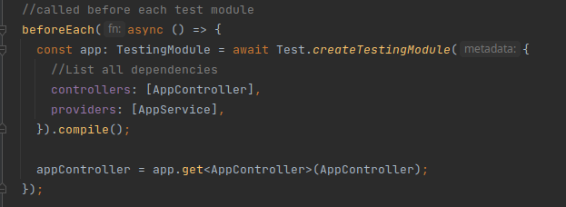

# Backend testing

Our newsletter backend contains one module : email module. In the following we will apply several types of tests on  it.
While generating our module, it automatically generates files .spec in it. Those files are our testing files. We will create our testes inside the controller.spec and service.spec.

## Let's take a tour of our SPEC file

The testing uses Jest.

We are creating a fake module. We are simulating the minimum module to simulate a test.

To run our test files we use
```shell
npm run test:watch
```
## Unit testing

First we will test our email controller isolated.
Since it is calling the email Service, we will mock our service :
```ts
const mockEmailService = {};
beforeAll(async () => {
    const module: TestingModule = await Test.createTestingModule({
        controllers: [EmailController],
        providers: [EmailService],
    }).overrideProvider(EmailService)
    .useValue(mockEmailService)
    .compile();
});
```
Why do we mock the service? because in the constructor of our controller we initiate an instance of the service. So nest injects the service when the controller is created. And for our testing the controller is created. And since we want to unit test our controller we need to not use the service.

We are going to test the create function of our controller :
```ts
//Add the function implementation to our mock service
const mockEmailService = {
    create: jest.fn((dto) => {
      return {
        id: Date.now(),
        ...dto,
      };
    }),
  };

//New describe block to test our add email function
describe('add To Newsletter', () => {
    it('should add a new subscriber', () => {
        expect(controller.create({ email: 'test@test.test' })).toEqual({
            id: expect.any(Number),
            email: 'test@test.test',
        });
    });
    //test the service call with params
    it('should call service with params', async () => {
        await controller.create({ email: 'test@t.com' });
        expect(mockEmailService.create).toHaveBeenCalledWith({
            email: 'test@t.com',
        });
    });
});
```